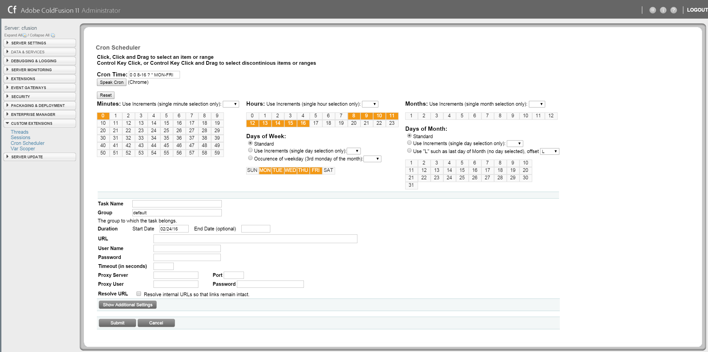
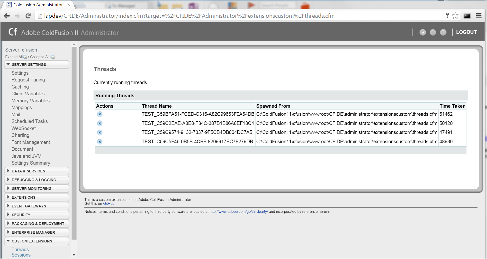
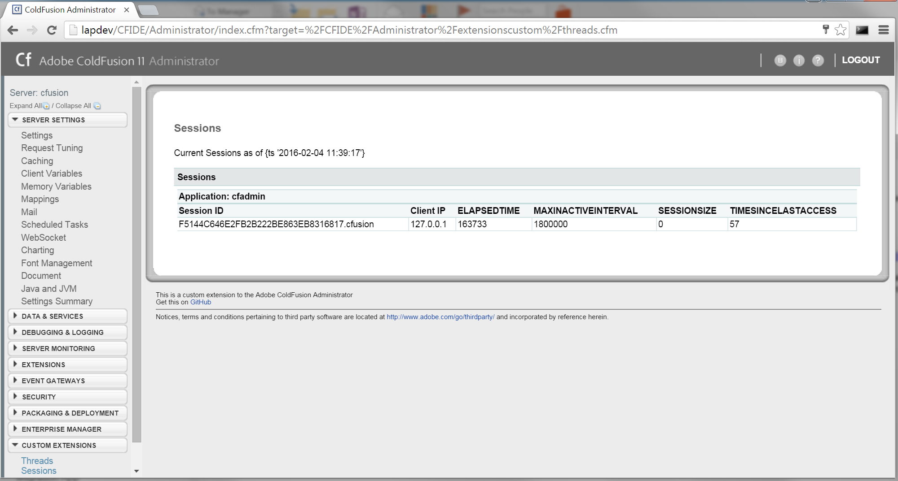

# CFIDE Administrator Custom Extensions
This repository contains custom extensions that extend the functionality of the ColdFusion CFIDE Administrator.

### Current Extensions
* Cron Scheduler: GUI for creating crontime.  Configure your crontime by selecting individual or ranges of date/time items.  Most standard CF sechedule parameters supported, excluding those that are obvious such as non cron time selections.  Publish option is still being worked on.  Submit will add the task and redirect to the scheduled tasks page. 

* Thread Tracker: Shows currently running threads with the ability to kill individual threads.  Adaptation to ColdFusion UI of functions created by [Upendra Roul] (http://coldfusion-tip.blogspot.com/2012/02/kill-coldfusion-thread-using-admin-api.html)

* Session Tracker: Shows currently active sessions. Adaptation to ColdFusion UI of functions created by David Crawford <dcrawford@acteksoft.com> with modifications by  Rob Brooks-Bilson <rbils@amkor.com> and Nathan Dintenfass

### Installation 
Place the extensionscustom folder in your ColdFusion CFIDE Administrator directory; C:\ColdFusion11\cfusion\wwwroot\CFIDE\administrator\extensionscustom

Move the extensionscustom.cfm from the extensionscustom folder to the parent folder.
(optionally you can customize the custommenu.xml, but that is a different topic)

# Licenses
|Library|Source|License|
|---|---|---|
|jQuery|https://jquery.com/|[MIT License](http://www.opensource.org/licenses/mit-license.php)|
|jQuery-ui|https://jqueryui.com/|[Mit License](http://www.opensource.org/licenses/mit-license.php)|
|jQuery.auto-group-input|https://github.com/Pixabay/jQuery-autoGrowInput|[MIT License](http://www.opensource.org/licenses/mit-license.php)|
|Adobe UI Design|[Adobe](http://www.adobe.com/products/coldfusion-family.html)|Adobe|
|Everything Else|[Christopher Wigginton](https://github.com/wiggick/ColdFusion-CFIDE-Administrator-Extensions)|[MIT License](http://www.opensource.org/licenses/mit-license.php)|
